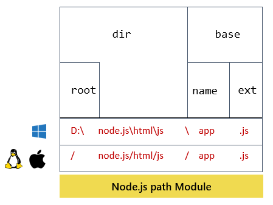

# `path` Module 🚀🔥

### NodeJS path module

- NodeJS provides you with the path module that allows you to interact with file paths easily.
- The path module has many useful properties and methods to access and manipulate paths in the file system.

- Useful path properties
  - The path object has the sep property that represents the platform-specific path separator.

### NodeJS Path Module Structure for windows, mac and linux

### Handy path methods

- The following shows some handy methods of the path module that you probably use very often.

`path.basename(path, [ext])`
`path.dirname(path))`
`path.extname(path))`
`path.format(pathObj)`
`path.isAbsolute(path)`
`path.join(...path)`
`path.normalize(path))`
`path.parse(path)`
`path.relative(from, to)`
`path.resolve(...path)`
