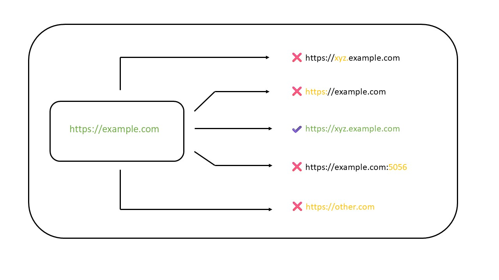

# What and Why CORS ? 🚀🔥

## What is Cross-Origin Resource Sharing (CORS)

_"Cross-Origin Resource Sharing (CORS) is an HTTP-header based mechanism that allows a server to indicate any origins (domains, scheme, or port) other than its own from which a browser should permit loading resources."_

**The Problems CORS trying to solve.**



Sharing the resource safetly across the origin is the main issue before the CORS was introduced.

### How does the CORS work ?

- Website on **"example.com"** makes a request to the API on **"api.example.org"**
- Before the actual request is sent, the browser sends a preflight request to the server hosting the API (**"api.example.org"**). This preflight request is an **HTTP OPTIONS** request that asks the server whether it will allow the actual request.
- The Server hosting the API responds to the preflight request with a set of headers that indicate whether the request is allowed or not. These headers include **"Access-Control-Allow-Origin"**,**"Access-Control-Allow-Methods"**, and **""Access-Control-Allow-Headers""**
- If the server responds with headers that allow the request, the browser sends that request to the API and retreives the request data.

For example, the preflight request might look like this:

```
OPTIONS /api/data HTTP/1.1
Host: api.example.com
Origin: https://example.com
Access-Origin-Request-Method: GET
Access-Origin-Request-Headers: authorization
```

And the server might respond with headers like this:

```
OPTIONS /api/data HTTP/1.1 200 OK
Host: api.example.com
Origin: https://example.com
Access-Origin-Request-Methods: GET, POST
Access-Origin-Request-Headers: authorization
```

This indicates that the request from **"example.com"** is allowd, and the actual API can proceed.

### Why are you getting a CORS error ?

_One of the top reasons for CORS error is development is that the server you are sending a request to might not include the expected **access-control-allow-origin** header in the responses it sends back to you. or if it does, it doesn't include your frontend app's URL in the list of approved origins._

### Few ways to reslove CORS error:

Step1 - Setting CORS headers in the API response.

```JavaScript
const express = require("express");
const cors = require("cors");
const app = express();

app.use(cors());
// your API endpoints here
```

Step2 - Enabling core in server-side API:

```JavaScript
app.get("/api", (req, res) => {
    res.setHeader("Access-Control-Allow-Origin", "*");
    // res.setHeader("Access-Control-Allow-Origin", "https://example.com") allows the mentioned domain
    res.setHeader("Access-Control-Allow-Methods"."GET.POST.PUT.DELETE");
    res.setHeader("Access-Control-Allow-Headers", "Context-Type");
    // your API Logic here
})
```
